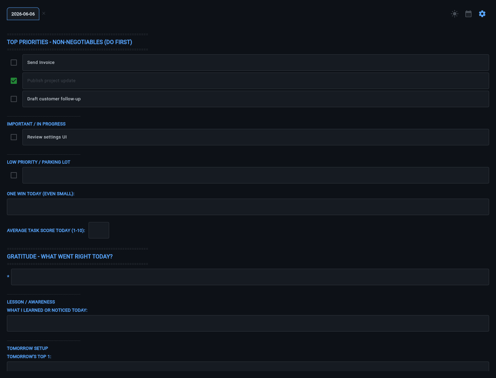
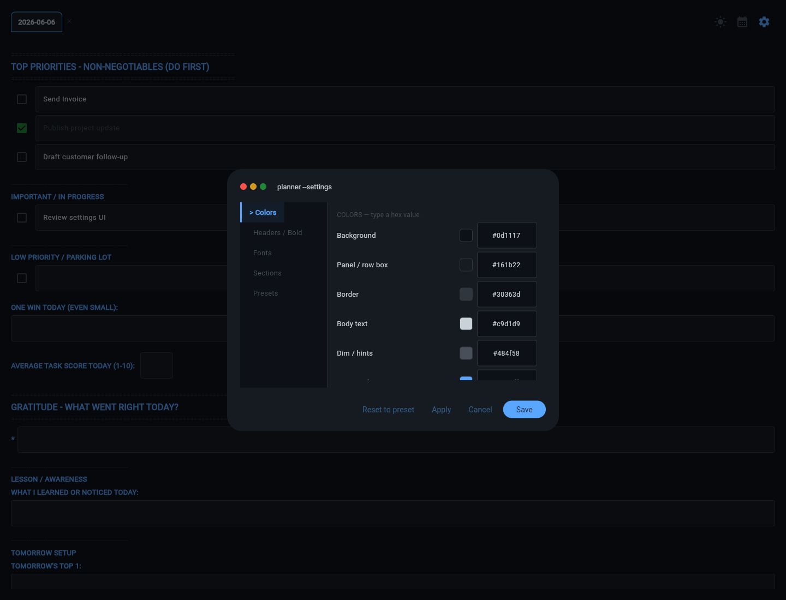
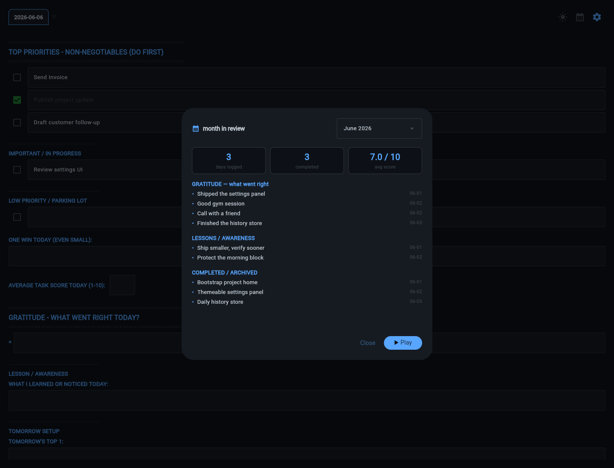
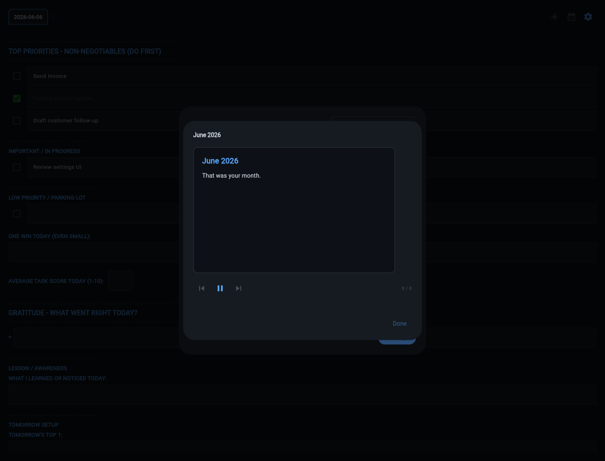
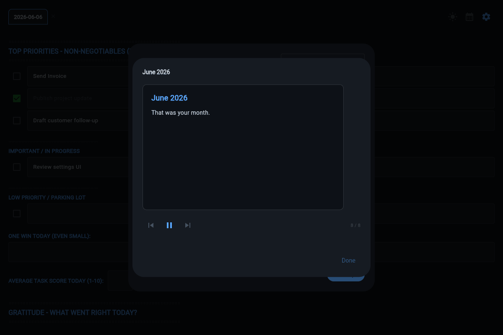

# Daily Planner

Daily Planner is a local-first desktop planner for organizing daily work, custom routines, reflections, and month-in-review recaps without putting personal planning data in the cloud.




## Features

- Multi-day planner tabs with one page per day.
- Editable blue section headers: rename, hide, or add your own sections for the way you plan.
- Add, remove, archive, and restore task rows with completion history.
- Themeable terminal-style settings for colors, headers, fonts, and section labels.
- Month-in-Review recap with stats, completed-task summaries, gratitude, lessons, and playback mode.
- Local JSON persistence with no account, sync service, or cloud dependency.
- Optional `planner_edit.py` CLI for safe local automation against a chosen planner data file.

## Screenshots

| Main Planner | Settings |
| --- | --- |
|  |  |

| Month in Review | Playback |
| --- | --- |
|  |  |



## Quick Start

```bash
python -m pip install -r requirements.txt
python daily_planner.py
```

The app opens as a Flet desktop window and stores planner data on your machine.

## Data Location

By default, Daily Planner stores one JSON file outside the repo:

- Windows: `%APPDATA%\DailyPlanner\daily_planner.json`
- macOS/Linux: `~/.daily_planner/daily_planner.json`

To choose a specific file, set `DAILY_PLANNER_DATA_FILE` before launching:

```bash
set DAILY_PLANNER_DATA_FILE=C:\path\to\daily_planner.json
python daily_planner.py
```

PowerShell:

```powershell
$env:DAILY_PLANNER_DATA_FILE = "C:\path\to\daily_planner.json"
python .\daily_planner.py
```

## Hotkeys

| Key | Action |
| --- | --- |
| `Ctrl+Enter` | Add a new row to the current section |
| `Ctrl+Backspace` | Archive the current row |
| `Ctrl+Z` | Undo |
| `Ctrl+Y` | Redo |
| `Ctrl+M` | Month in Review |
| `Enter` | New line within the current field |

## Development

```bash
python -m pip install -r requirements.txt
python -m pytest -q
```

Visual QA with fake data:

```bash
python scripts/qa_visual.py
```

Then open `http://127.0.0.1:8771/`.

More details are in [docs/usage.md](docs/usage.md).

## License

MIT - see [LICENSE](LICENSE).
